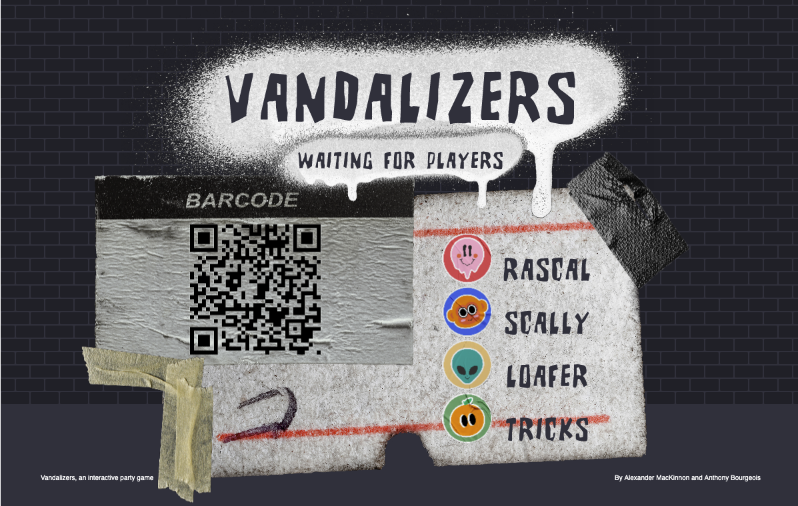
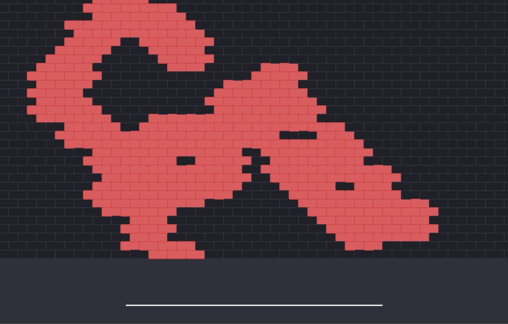
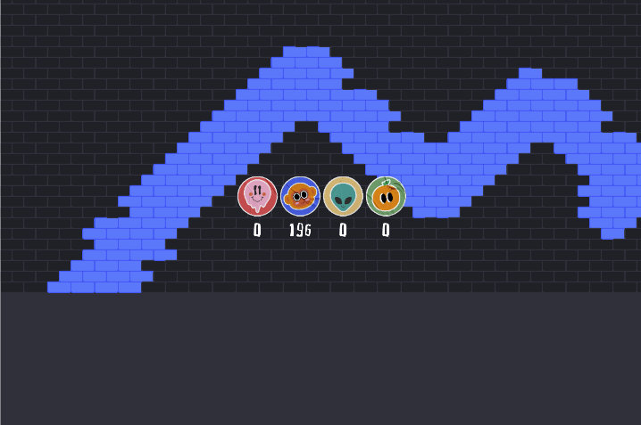

# Vandalizers

A Playful Interaction
by Alexander MacKinnon & Anthony Bourgeois

## About the Game

Vandalizers is an interactive party game in which users compete in a brick wall vandalization contest. The objective is to conquer with the player's assigned color the most amount of territory on the brick wall by throwing paint. After a 30 second showdown, the bricks are counted by the system to see how many bricks each player painted in that timeframe, and declares the winner based on the amount of bricks controlled. The game uses the iPhone's gyroscope and connects the phone via MQTT to a receiving screen.

